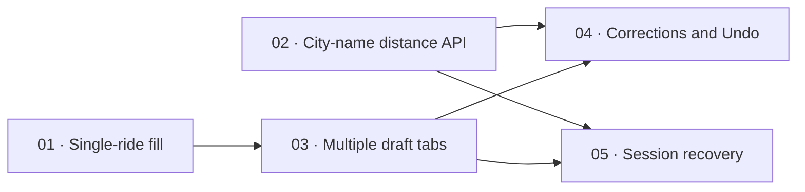

# Ride-offer implementation tickets

Approved local implementation tickets, based on the [ride-offer specification](../ride-offer-language-issue.md). The user approved the five-ticket breakdown and blocking edges. All five tickets are implemented and verified. See [completion evidence](../../docs/verification/ride-offers.md). No GitHub issues have been created.

| Ticket | Blocked by | Complete behavior |
| --- | --- | --- |
| [01: Fill and publish one ride offer from a description](issues/01-fill-one-ride-offer.md) | None | A driver enters a description such as “going skp to bt 4pm saturday with a clio”, clicks Fill form, reviews the known details in the existing offer form, completes missing values and explicitly publishes one ride. |
| [02: Calculate driving km from the two filled city names](issues/02-distance-from-filled-cities.md) | None | After origin and destination city fields are filled in the shared offer form, the form sends those two city-name strings to the application's distance API and fills the returned road kilometres. |
| [03: Create and publish multiple ride-draft tabs](issues/03-multiple-trip-tabs.md) | 01 | A multi-trip description creates one independently editable tab for every recognized explicit trip. |
| [04: Correct the active ride draft and undo the change](issues/04-active-draft-corrections-undo.md) | 02, 03 | With several ride drafts open, the driver can make a short correction to the active draft, retain omitted information, resolve ambiguous replacements visibly and undo the entire applied change, including its route-distance effects. |
| [05: Recover unfinished ride-draft tabs within the browser session](issues/05-session-draft-recovery.md) | 02, 03 | The same signed-in driver can refresh or navigate away and return to the unfinished draft set within the current browser session. |

## Ordering and integration

- The initial frontier is 01 and 02. Both deliver usable behavior against the existing shared offer form.
- Ticket 03 depends on 01's interpretation/form application, but does not require automatic distance to demonstrate separate ride drafts and publication.
- Tickets 04 and 05 require 02 and 03. Both need the real city-based distance state and stable independent draft identities. Neither requires the other's implementation to start.
- Keep necessary form-state prefactoring at the start of 01 and verify existing flows before adding fill behavior. Do not create an isolated horizontal refactor, API-only, UI-only or testing-only ticket.
- Shared-form edits require coordinated integration, but an overlapping file alone is not a functional blocking edge. Re-run combined workflow checks when 04 and 05 are both integrated; the last integrated ticket owns those checks.
- Every ticket includes behavior, implementation across necessary layers, relevant tests and documentation. Follow the repository's framework, database-documentation and verification requirements. No application implementation or GitHub publication is part of this ticket-drafting task.

## Key distance requirement

Fill both city fields first, then send the two selected city-name strings to the application distance API. The server validates those names and translates them to catalog city coordinates for OSRM. The returned kilometres populate the requesting form. Selected pickup points do not change the automatic distance.
