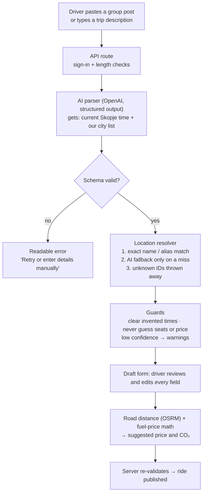

# Ajde — student ride sharing between Macedonian cities

Ajde helps students in Skopje find a shared ride home to their city, split the real fuel cost, and
keep extra cars off the road. Drivers describe a trip the way they'd write it in a Viber group, in
Macedonian, Albanian or English, and AI turns it into a ride listing they check before publishing.

**Live demo:** _TODO: deployed URL_ · **Backup video:** _TODO: video link_

## Who it is for

**A student studying in Skopje who goes home to Bitola, Ohrid, Kočani or Struga most weekends.**
Today they scroll six or more Facebook and Viber groups, one per route. Each gets 10–20 posts a day,
all in free text, and a post is buried within minutes. The driver on the other side guesses a price
and often leaves with empty seats.

- **We talked to students before building.** We interviewed student friends who live in different
  cities and travel home from Skopje, and fed what they told us into what we built and in which order.
  <!-- TODO: add 2–3 short quotes or findings (name/city optional), e.g. "…" — Ana, Bitola -->
- **The problem is real, not assumed.** The landing page shows real ride posts from these groups
  this week ([`public/landing/`](ride-share-app/public/landing),
  [`about-sections.tsx`](ride-share-app/components/landing/about-sections.tsx)). Those posts are
  also why the AI has to read Cyrillic shorthand timetables, Latin transliteration and Albanian.
- **Why they'd still use it next month:** the trip home repeats every week, and the price split,
  saved car and ratings carry over from one trip to the next.
- **Green, honestly:** three passengers in one car means three fewer car trips. The CO₂ counter
  only counts completed rides with a real distance and a petrol or diesel car, and excludes demo
  data ([assumptions](docs/SAFETY.md#co2-impact-assumptions)).

## What you can do in it

1. Sign in with a university email (for example `@students.finki.ukim.mk`) and complete a profile with a photo.
2. **Find a ride:** filter by route, date and seats, or just type "Bitola Friday after 4".
3. **Offer a ride:** type "Skopje → Ohrid Saturday 4pm, back Sunday evening, 3 seats", or paste an
   existing group post. Review the draft, pick your car, see the suggested fair price per seat, publish.
4. Request a seat. The driver accepts or declines. Contacts are revealed only after acceptance.
5. Ask questions under the ride, chat in a private ride room, and share your trip with family
   through a link that expires.
6. After the trip, the driver marks it completed. Both sides rate each other, and the CO₂ saved is counted.

## How the AI works



| AI job | File | What would break without AI |
| --- | --- | --- |
| Read a messy group post into a ride draft | [`lib/ai/parse-ride-post.ts`](ride-share-app/lib/ai/parse-ride-post.ts) | Posts mix Cyrillic, Latin, Albanian, landmarks ("од Рамстор") and relative dates; regex can't keep up |
| Turn a free-text trip description into one draft per trip | [`lib/ai/parse-offer-description.ts`](ride-share-app/lib/ai/parse-offer-description.ts) | Return trips, shared details and "Saturday 4pm" in Skopje time |
| Map a place name the aliases missed onto our city list | [`lib/ai/openai-location-fallback.ts`](ride-share-app/lib/ai/openai-location-fallback.ts) | Spelling variants and transliterations |
| Turn a search phrase into filters | [`lib/ai/parse-search-query.ts`](ride-share-app/lib/ai/parse-search-query.ts) | "Ohrid slednive nekolku dena okolu 5" |
| Explain why a ride matches your search | [`lib/ai/explain-match.ts`](ride-share-app/lib/ai/explain-match.ts) | — (falls back to plain facts) |
| **PLACEHOLDER / TODO:** screenshot → reader → parser → checker that calls tools | _in progress, not merged_ ([plan](archived-plans/2026-09-22/22-09-ai-pipeline.md)) | Photos of group chats |

**When the AI is confidently wrong:** the model never publishes anything. It only fills a draft
that a person reviews, and the server validates the draft again on submit. The model can't
invent a city: every place ID must exist in our database or it's discarded. Invented departure
times are cleared, and missing seats or prices stay empty. Uncertain output shows warnings in the
form. If OpenAI is down, search falls back to the manual filters and the ride list still loads.
The price and CO₂ numbers are deliberately plain arithmetic, not AI, so they can be checked by
hand. More detail in [docs/AI.md](docs/AI.md).

### What is real and what is not

| Real | Demo / assumption |
| --- | --- |
| Live OpenAI calls for parsing, search and explanations | 25 demo profiles and 50 demo rides, seeded so the feed isn't empty (flagged `demo_seed`, excluded from CO₂ totals) |
| Supabase auth, database, photo storage and Realtime chat | Fuel prices are values we set in `.env`, not a live feed |
| Road distance from the public OSRM router | Car fuel consumption is a representative, rounded value per catalog model |
| Real group posts on the landing page and in the parser tests | No payments: the app suggests a price, and passengers settle with the driver themselves |

## How to run it

You need Node.js 20.9+, a Supabase project, `psql`, and an OpenAI API key.
[docs/SETUP.md](docs/SETUP.md) has every step and environment variable.

```sh
git clone <repository-url>
cd lightweight-repo/ride-share-app
npm ci
cp .env.example .env.local        # fill in Supabase URL/keys, DATABASE_URL, OPENAI_API_KEY, fuel prices

# create the schema and demo data (run once against an empty Supabase database)
set -a; . ./.env.local; set +a
for m in supabase/migrations/*.sql; do psql "$DATABASE_URL" -X -v ON_ERROR_STOP=1 -f "$m" || break; done

npm run dev                       # http://localhost:3000
npm test                          # 595 tests, no network needed
```

Sign-in uses a magic link, sent only to domains in `STUDENT_EMAIL_DOMAINS`. For local testing
without email, set `DEV_AUTH_BYPASS=true` and `SUPABASE_SECRET_KEY`. The bypass is ignored in production.

## What is finished and what is not

**Finished and working end to end:** student sign-in and onboarding; manual, described and
imported ride offers; car catalog with fuel-cost and CO₂ suggestion; automatic road distance;
feed with filters and AI search; seat requests with accept, decline and cancel; contact reveal
after acceptance; ride Q&A; share-my-trip links; private ride chat; ride completion; ratings;
personal and platform CO₂ counters.

**Not finished:**

- **Screenshot → checked-ride AI pipeline:** PLACEHOLDER / TODO, in progress on a separate branch.
- Unclaimed imported rides, reporting users, AI spam screening, recurring rides, payments, live location.

### Known issues

- **Security is not production-ready.** Row-level security is enforced only on chat messages and
  ratings. The other tables rely on server-side checks in our code, so a user calling Supabase
  directly with the public key could bypass them.
- Our AI accuracy numbers come from small test sets: 5 posts, 12 searches, 4 descriptions. The
  model can still be wrong, which is why every draft goes through human review.
- A booking approved at the exact moment a ride departs isn't guarded by a transaction
  ([ticket](docs/tickets/21-09-pero/06-atomic-booking-decisions.md)).
- Distance is city-centre to city-centre, not pickup to pickup ([why](docs/adr/0001-city-to-city-road-distance.md)).
  The free OSRM server is shared, so we rate-limit it and fall back to manual km.
- CO₂ is estimated only for petrol and diesel cars. Fuel prices must be updated by hand.
- Migrations are applied with a `psql` loop, not a migration tool.

### What we tried to break

Empty input, huge input, four scripts and languages, unknown places, OpenAI down, OSRM down, double
submits, two people booking the last seat, and a browser in another timezone. Each case and its
result is in [docs/TESTING.md](docs/TESTING.md), along with the test suite and live AI evaluations.

## How we built it

**Team:** Filip Gavrilovski (Gavro), Dimitar Arsov (Dimi), Petar Srbinoski (Pero).

**Stack and why:**

- **Next.js (App Router):** UI and server API in one TypeScript project, and the OpenAI key never
  reaches the browser.
- **Supabase:** Postgres, auth, photo storage and Realtime chat from one service, with row-level
  security available in SQL. That saved a day of backend setup.
- **OpenAI structured outputs + Zod:** the model must return our exact draft shape. The same Zod
  schema validates the form and the server.
- **OSRM:** free road distances with no API key ([research](docs/research/free-road-distance-api.md)).
- **Vitest:** fast tests with mocked AI.

**How we used AI.** Most of the code was written by AI coding agents (Codex and Claude Code). Our
master plan estimates about 95% of feature code, and that let us spend our time on the parts AI
can't decide for us. We decided the scope and the data model, and who sees whose contact details.
We chose which numbers must *not* come from AI, and where a human has to review. We tuned the parser
on real posts, wrote the guards, and checked the security rules. Each day we wrote a plan, split it
into two parallel tracks so we didn't edit the same files, generated the code, and read and fixed the
diffs. After that came tests and a verification write-up. The plans are in
[archived-plans/](archived-plans/README.md), and review findings are in [docs/verification/](docs/verification/).

**Commits:** about 170 Conventional Commits over 20–22 September, on feature branches merged into
`main` ([CONTRIBUTING.md](CONTRIBUTING.md)). Bugs appear as `fix(...)` commits after the feature
that introduced them.

## What we'd build next with another week

1. Finish the screenshot pipeline: a vision reader, the parser, then a checker that calls tools
   (road distance, fair price, similar rides) to cross-check the draft.
2. Row-level security on every table, then a public launch to FINKI students.
3. Recurring rides ("every Friday 15:00 Skopje → Bitola") and notifications when a matching ride appears.
4. Unclaimed imported rides, so passengers can find drivers who only post in Viber, plus reporting and AI spam screening.
5. A mobile app or PWA with push notifications, and pickup-level distances.

## Repository map

```text
.
├── ride-share-app/            the Next.js app
│   ├── app/                   pages, API routes, server actions
│   ├── components/            UI components (landing, discovery, chat, ratings)
│   ├── lib/ai/                every AI step and its guards  ← start here
│   ├── lib/                   rides, bookings, auth, sharing, impact, Supabase clients
│   ├── fixtures/              real-post, search, chat and rating test fixtures
│   ├── scripts/               live AI evaluations and browser verification
│   └── supabase/              migrations, seed data, schema smoke test, DATABASE_MODELS.md
├── docs/                      setup, AI, safety, testing, ADRs, verification records, glossary
└── archived-plans/            master plan and the daily plans we built from
```
