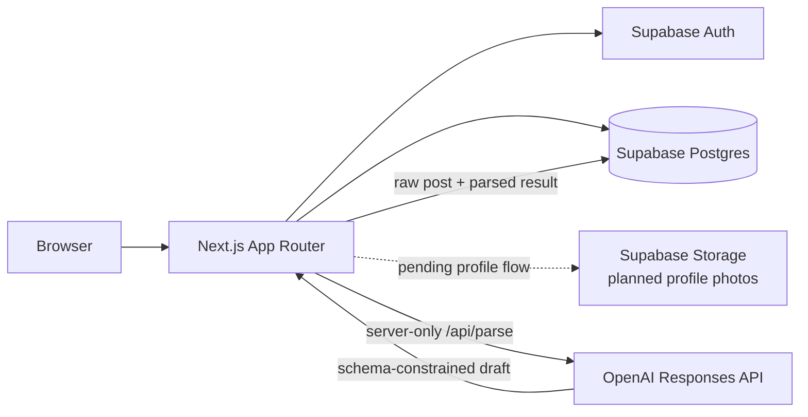
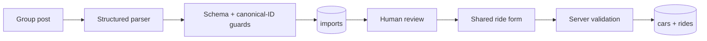

# Student Ride Share — Skopje

A student-focused ride-sharing prototype for people studying in Skopje who travel home to other
cities and want to share real fuel costs instead of searching through several Viber or Facebook
groups.

The most distinctive workflow turns an informal Macedonian, mixed-script, or Albanian group post
into a structured **draft**. The driver reviews and edits every extracted field before anything can
be saved or published.

> This repository is under active hackathon development. The ride-creation and AI-import slice is
> implemented; identity, discovery, booking, and production authorization work is still incomplete.

## Feature status

| Area | Status | Notes |
| --- | --- | --- |
| Database schema and seed catalog | Implemented | Core tables, seat-count triggers, 10 cities, Skopje pickup points, and common car models |
| Manual ride creation | Implemented | Route, pickup points, time, seats, car, price, notes, tags, and gender preference |
| Car catalog and manual cars | Implemented | Catalog selection prefills fuel/consumption; overrides create a driver-owned snapshot |
| Fuel-price and CO2 estimate | Implemented | Petrol/diesel arithmetic using server-configured fuel prices; suggestion remains editable |
| Group-post import and review | Implemented | Structured OpenAI parsing, warnings/confidence, saved import, and editable ride prefill |
| Authentication infrastructure | Partial | Supabase SSR clients and protected ride routes exist; login/callback/onboarding UI is pending |
| Location normalization | Partial | Model-selected IDs are constrained and validated; the hybrid `resolveLocation` integration is pending |
| Feed, ride detail, and bookings | Planned | No browse, request, approve/decline, or passenger dashboard UI yet |
| Natural-language search and sharing | Planned | Search, match explanations, and public trip links are not implemented |
| Production authorization | Planned | Row-level security policies are intentionally deferred and must be added before deployment |

## Architecture



The application lives in `ride-share-app/`. Next.js Server Components, Route Handlers, and Server
Actions use a request-scoped Supabase client. The browser receives only Supabase's public project
key. OpenAI credentials, database credentials, and fuel-price assumptions remain server-side.

### Import-to-ride boundary



Model output never publishes a ride directly. Imported and manually entered rides use the same
draft contract, and the stricter publishable schema is checked again on the server.

More detail:

- [Database model](ride-share-app/supabase/DATABASE_MODELS.md)
- [Parser fixture evaluation](ride-share-app/fixtures/posts/README.md)
- [Release-readiness audit](docs/release-readiness-audit.md)

## Local setup

### Requirements

- Node.js 20.9 or newer
- npm with lockfile-v3 support
- A Supabase project
- PostgreSQL `psql` for the documented migration and smoke-test commands
- An OpenAI API key to use post import or the live parser evaluation

The repository does not yet pin a specific Node/npm version. The latest verified environment used
Node.js 23.7.0 and npm 11.2.0.

### 1. Install

```sh
git clone <repository-url>
cd lightweight-repo/ride-share-app
npm ci
```

All following commands assume the current directory is `ride-share-app/`.

### 2. Configure environment variables

```sh
cp .env.example .env.local
```

Fill in `.env.local` without committing it:

| Variable | Required for | Notes |
| --- | --- | --- |
| `NEXT_PUBLIC_SUPABASE_URL` | Application startup and Supabase pages | Browser-visible project URL |
| `NEXT_PUBLIC_SUPABASE_PUBLISHABLE_KEY` | Supabase access | Browser-visible public key; legacy projects may use `NEXT_PUBLIC_SUPABASE_ANON_KEY` instead |
| `DATABASE_URL` | Migrations and schema smoke test | Use the session-pooler PostgreSQL URL on port 5432 |
| `OPENAI_API_KEY` | `/api/parse` and parser evaluation | Server-only; never prefix it with `NEXT_PUBLIC_` |
| `OPENAI_MODEL` | Optional parser override | Defaults to `gpt-5.4-mini` |
| `FUEL_PRICE_PETROL_MKD_L` | Petrol cost estimate | Optional at startup; verify the current MKD/L value before a demo |
| `FUEL_PRICE_DIESEL_MKD_L` | Diesel cost estimate | Optional at startup; verify the current MKD/L value before a demo |
| `SUPABASE_SERVICE_ROLE_KEY` | Reserved for future admin/seed tooling | Present in the sample but not read by current code |

`.env.local` is ignored by Git. Only the blank `.env.example` contract is tracked.

### 3. Create the database

There is no committed Supabase CLI project configuration yet. Against a new Supabase database,
load the local environment into the current shell, then apply the migration files once in filename
order:

```sh
set -a
. ./.env.local
set +a

for migration in supabase/migrations/*.sql; do
  psql "$DATABASE_URL" -X -v ON_ERROR_STOP=1 -f "$migration" || exit 1
done
```

Alternatively, paste each file into the Supabase SQL Editor in the same order. The initial migration
creates the schema and is not intended to be reapplied to an existing database.

Verify the migrated schema and triggers with the rollback-safe smoke test:

```sh
psql "$DATABASE_URL" -X -v ON_ERROR_STOP=1 -f supabase/tests/schema_smoke.sql
```

### 4. Configure external services

In Supabase:

1. Copy the project URL and publishable/anon key into `.env.local`.
2. Copy the session-pooler database connection string into `DATABASE_URL`.
3. Enable and configure email authentication before using the forthcoming magic-link flow.
4. Add local and deployed auth redirect URLs after the auth callback route lands.
5. Create the profile-photo Storage bucket and policies after the onboarding implementation lands.

Email-domain rules, the auth callback, onboarding, and Storage policies are not present on this
branch yet. They cannot be completed by environment values alone.

### 5. Run

```sh
npm run dev
```

Open [http://localhost:3000](http://localhost:3000). To check Supabase wiring while signed out, open
`http://localhost:3000/api/health/supabase`; a response containing `"ok": true` and `"user": null`
is a successful anonymous connectivity check.

`/rides/new`, `/rides/import`, and `/api/parse` require a valid session. Until the login flow is
merged, signed-out visits redirect to the currently missing `/login` route.

## Verification commands

Run from `ride-share-app/`:

```sh
npm test
npm run lint
npx tsc --noEmit
npx next build --webpack
```

The current suite contains 31 focused tests covering ride-draft validation, form parsing, car
selection, price/CO2 calculations, canonical parser guards, and fixture behavior.

The live parser evaluator makes real OpenAI requests:

```sh
npm run eval:parser
```

It fixes the evaluation timestamp for repeatable relative-date expectations and reports accuracy by
classification, route, departure, seats, and price. The latest recorded result is 5/5 in each field
on five curated fixtures; that is a regression signal, not a production-accuracy claim.

## Current implemented flow

Once authentication is available, the implemented slice is:

1. Open `/rides/import` and paste a Viber, Facebook, or other group post.
2. The server loads canonical cities/pickup points and asks OpenAI for schema-constrained output.
3. Review classification, route IDs, departure, seats, price, confidence, and warnings.
4. Continue to `/rides/new?import=<id>`.
5. Correct or complete the draft, choose a car, review the cost estimate, and explicitly save or
   publish the ride.

The larger judge-demo flow then calls for browsing/searching, requesting a seat, driver approval,
contact reveal, and a public share link. Those later stages are planned but are not implemented in
the current repository.

## How AI is used

`parseRidePost` uses the OpenAI Responses API with a Zod-backed structured-output schema. It is
designed for informal posts containing Macedonian Cyrillic, Latin transliteration, mixed scripts,
Albanian, landmarks, relative dates, offer/request wording, and several price modes.

The parser receives:

- An explicit current timestamp and the `Europe/Skopje` timezone
- Only the canonical city and pickup candidates loaded from Supabase
- Instructions to preserve uncertainty as warnings and leave unknown fields null
- The same partial ride-draft contract the review form consumes

After the model responds, ordinary code validates the schema, rejects unknown or city-mismatched
IDs, clears invented departure times when the post supplied no time, and adds low-confidence review
warnings. The raw post and structured result are stored together for the review step.

The pending `resolveLocation` integration will add deterministic alias/fuzzy matching before a model
fallback. Until that lands, candidate restriction prevents invented IDs but does not guarantee that
the model chose the semantically correct candidate.

The fair-price and CO2 calculator is intentionally **not AI**. It uses transparent arithmetic:

```text
distance_km × consumption_l_100km / 100 × fuel_price_mkd_l / seats
```

Tailpipe factors are 2.31 kg CO2/L for petrol and 2.68 kg CO2/L for diesel. Other fuel types are
reported as unsupported rather than receiving an invented conversion factor, and the driver may
always override the suggested price.

## Safety and privacy

Implemented protections:

- Ride creation and post parsing check the Supabase session on the server.
- Imported records and saved cars are checked against the authenticated user's ID.
- Form input is validated in the UI contract and again in the Server Action.
- Duplicate submissions are detected through a submission UUID.
- Imported model output always goes through human review.
- Public Supabase keys are separated from server-only secrets.

The product plan also calls for student-domain verification, required real-name/photo profiles,
driver approval, private contact reveal after acceptance, same-gender ride preferences, trip-share
links, reports, and a record of confirmed passengers. Some supporting columns already exist, but the
end-to-end enforcement and UI for these promises are not complete and should not yet be presented as
production safety guarantees.

## Known issues and limitations

- Login, auth callback, onboarding, public profiles, and profile-photo upload are not yet merged.
- Row-level security policies are absent. Do not deploy the current database as a production system.
- The deterministic/model-fallback `resolveLocation` module is not yet connected to post parsing.
- Feed, filters, ride details, bookings, dashboards, comments, chat, ratings, and trip sharing are
  not implemented.
- Parser accuracy has only been measured on five curated fixtures and model output can vary.
- Date-only posts deliberately leave departure empty for manual review; “after 6” uses 18:00 as an
  earliest boundary and adds a warning.
- Distance is entered manually; no routing/distance provider is integrated.
- Fuel-price environment values are manual assumptions and must be verified before presenting them.
- Automatic CO2 estimates currently cover petrol and diesel only.
- Migration execution and generated-type refresh are not wrapped in project scripts.
- The service-role variable is reserved but unused.

## Repository map

```text
.
├── PLAN.md                         product scope, schedule, and rubric mapping
├── 20-09-gavro-part-2.md          current documentation/release-readiness track
├── archived-plans/                completed implementation plans
├── docs/                           audit and release documentation
└── ride-share-app/
    ├── app/                        Next.js routes, Server Actions, and Route Handlers
    ├── fixtures/posts/             anonymized parser fixtures and evaluation notes
    ├── lib/ai/                     structured post parser and client-safe schema
    ├── lib/rides/                  ride contracts, form validation, car and estimate logic
    ├── lib/supabase/               browser/server clients and generated database types
    ├── scripts/                    live parser evaluator
    └── supabase/                   migrations, seeds, model documentation, and smoke test
```

## Build discipline

Work is developed on feature branches with Conventional Commit messages. See
[CONTRIBUTING.md](CONTRIBUTING.md) for the repository's exact commit and merge rules.

The deadline plan intentionally prioritizes a truthful, working demo over hiding unfinished scope.
If a feature is not in the status table as implemented, assume it is not ready for the demo.
