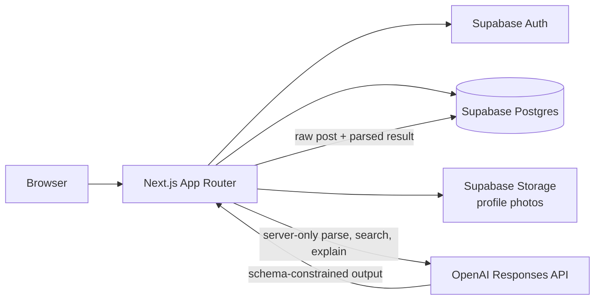
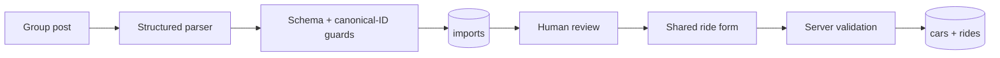

# Student Ride Share — Skopje

A student-focused ride-sharing prototype for people studying in Skopje who travel home to other
cities and want to share real fuel costs instead of searching through several Viber or Facebook
groups.

The most distinctive workflow turns an informal Macedonian, mixed-script, or Albanian group post
into a structured **draft**. The driver reviews and edits every extracted field before anything can
be saved or published.

> This repository is under active hackathon development. The Tier 1 journey and all planned Tier 2
> features, private ride rooms, and post-ride ratings are implemented. Production authorization
> remains unfinished outside the message/rating tables.

## Feature status

| Area | Status | Notes |
| --- | --- | --- |
| Database schema and seed catalog | Implemented | Core tables, seat-count triggers, 10 cities, pickup points, 50 car models, 25 demo profiles, and 50 future rides |
| Manual ride creation | Implemented | Route, pickup points, time, seats, car, price, notes, tags, and gender preference |
| Car catalog and manual cars | Implemented | Catalog selection prefills fuel/consumption; overrides create a driver-owned snapshot |
| Fuel-price and CO2 estimate | Implemented | Petrol/diesel arithmetic using server-configured fuel prices; suggestion remains editable |
| Group-post import and review | Implemented | Structured OpenAI parsing, warnings/confidence, saved import, and editable ride prefill |
| Authentication and onboarding | Implemented | Student-domain magic links, guarded local bypass, callback, profile completion, photo upload, and server-side route protection |
| Public profiles | Implemented | Deliberately limited projection excludes phone and social contact fields |
| Location normalization | Implemented | Deterministic name/alias matching first, structured model fallback on misses, and canonical-ID validation |
| Feed and ride detail | Implemented | Authenticated route/date/seat filters, ride cards, seat fullness, driver/car context, and responsive detail pages |
| Booking lifecycle | Implemented | Request, approve, decline, cancel, concurrency-safe seat holding, driver dashboard, passenger dashboard, and post-approval contact reveal |
| Natural-language search | Implemented | Structured OpenAI interpretation produces canonical route/time/seat filters; manual filters remain usable when the provider fails |
| AI match explanations | Implemented | Explanations are batched over server-reloaded visible rides and fall back to deterministic ride facts |
| Same-gender discovery | Implemented | Optional declared-gender filter is independent from AI search and does not expose gender on ride cards |
| Public ride Q&A | Implemented | Authenticated students can post on future published/full rides and delete their own comments |
| Share my trip | Implemented | Accepted passengers can create and revoke signed-out itinerary links that expire 24 hours after departure |
| Ride completion and CO2 impact | Implemented | Drivers complete/cancel rides; passenger and platform estimates count completed shared trips with explicit assumptions |
| Private ride rooms | Implemented | Driver and accepted passengers share a Realtime room; acceptance-time history and a 48-hour send window |
| Post-ride ratings | Implemented | Completed-ride counterpart ratings, private written feedback, and aggregate-only public reputation |
| Production authorization | Partial | Messages and ratings have RLS; other public tables still need policies before production deployment |

## Architecture



The application lives in `ride-share-app/`. Next.js Server Components, Route Handlers, and Server
Actions use a request-scoped Supabase client. The browser receives only Supabase's public project
key. OpenAI credentials, database credentials, and fuel-price assumptions remain server-side.

### Import-to-ride boundary



Model output never publishes a ride directly. Imported and manually entered rides use the same
draft contract, and the stricter publishable schema is checked again on the server.

More detail:

- [Database model](ride-share-app/supabase/DATABASE_MODELS.md)
- [Parser fixture evaluation](ride-share-app/fixtures/posts/README.md)
- [Ride-room setup and verification](ride-share-app/fixtures/chat/README.md)
- [Rating verification](ride-share-app/fixtures/ratings/README.md)

## Local setup

### Requirements

- Node.js 20.9 or newer
- npm with lockfile-v3 support
- A Supabase project
- PostgreSQL `psql` for the documented migration and smoke-test commands
- An OpenAI API key to use post import, AI search/explanations, or live evaluations

The repository does not yet pin a specific Node/npm version. The latest verified environment used
Node.js 23.7.0 and npm 11.2.0.

### 1. Install

```sh
git clone <repository-url>
cd lightweight-repo/ride-share-app
npm ci
```

All following commands assume the current directory is `ride-share-app/`.

### 2. Configure environment variables

```sh
cp .env.example .env.local
```

Fill in `.env.local` without committing it:

| Variable | Required for | Notes |
| --- | --- | --- |
| `NEXT_PUBLIC_SUPABASE_URL` | Application startup and Supabase pages | Browser-visible project URL |
| `NEXT_PUBLIC_SUPABASE_PUBLISHABLE_KEY` | Supabase access | Browser-visible public key; legacy projects may use `NEXT_PUBLIC_SUPABASE_ANON_KEY` instead |
| `DATABASE_URL` | Migrations and schema smoke test | Use the session-pooler PostgreSQL URL on port 5432 |
| `STUDENT_EMAIL_DOMAINS` | Student access policy | Server-only comma-separated exact domains |
| `OPENAI_API_KEY` | Post parsing, location fallback, natural-language search, match explanations, and live evaluations | Server-only; never prefix it with `NEXT_PUBLIC_` |
| `OPENAI_MODEL` | Optional ride-post parser override | Defaults to `gpt-5.4-mini` |
| `OPENAI_LOCATION_MODEL` | Optional location-fallback override | Defaults to `gpt-5-mini` |
| `OPENAI_SEARCH_MODEL` | Optional natural-language search override | Falls back to `OPENAI_MODEL`, then `gpt-5.4-mini` |
| `OPENAI_EXPLAIN_MODEL` | Optional match-explanation override | Falls back to `OPENAI_MODEL`, then `gpt-5.4-mini` |
| `FUEL_PRICE_PETROL_MKD_L` | Petrol cost estimate | Optional at startup; verify the current MKD/L value before a demo |
| `FUEL_PRICE_DIESEL_MKD_L` | Diesel cost estimate | Optional at startup; verify the current MKD/L value before a demo |
| `DEV_AUTH_BYPASS` | Local sign-in without sending email | Optional; honored only when exactly `true` outside production |
| `SUPABASE_SECRET_KEY` | Local development bypass | Preferred server-only admin key when the bypass is enabled |
| `SUPABASE_SERVICE_ROLE_KEY` | Local development bypass | Legacy alternative to `SUPABASE_SECRET_KEY` |

`.env.local` is ignored by Git. Only the blank `.env.example` contract is tracked.

### 3. Create the database

There is no committed Supabase CLI project configuration yet. Against a new Supabase database,
load the local environment into the current shell, then apply the migration files once in filename
order:

```sh
set -a
. ./.env.local
set +a

for migration in supabase/migrations/*.sql; do
  psql "$DATABASE_URL" -X -v ON_ERROR_STOP=1 -f "$migration" || exit 1
done
```

Alternatively, paste each file into the Supabase SQL Editor in the same order. The initial migration
creates the schema and is not intended to be reapplied to an existing database.

Verify the migrated schema and triggers with the rollback-safe smoke test:

```sh
psql "$DATABASE_URL" -X -v ON_ERROR_STOP=1 -f supabase/tests/schema_smoke.sql
```

### 4. Configure external services

In Supabase:

1. Copy the project URL and publishable/anon key into `.env.local`.
2. Copy the session-pooler database connection string into `DATABASE_URL`.
3. Enable email authentication for the magic-link flow.
4. Allow the local and deployed `/auth/callback` URLs in Supabase Auth redirect configuration.
5. Apply all migrations: the profile-photo bucket and its ownership policies are created by
   `20260920130000_add_profile_photo_storage.sql`.

The app checks `STUDENT_EMAIL_DOMAINS` before sending a link and again after callback/session
creation. Exact domain matching is used; suffix matches are not accepted.

### 5. Run

```sh
npm run dev
```

Open [http://localhost:3000](http://localhost:3000). To check Supabase wiring while signed out, open
`http://localhost:3000/api/health/supabase`; a response containing `"ok": true` and `"user": null`
is a successful anonymous connectivity check.

`/rides/new`, `/rides/import`, and `/api/parse` require a valid session. New users are sent through
`/onboarding` until their name, university, and profile photo are complete.

If hosted email is rate-limited during local development, set `DEV_AUTH_BYPASS=true` and configure
`SUPABASE_SECRET_KEY` (or the legacy service-role key). The separate bypass button appears only
outside production, still requires an allowed student-domain address, and creates an ordinary
cookie-backed Supabase session.

## Verification commands

Run from `ride-share-app/`:

```sh
npm test
npm run lint
npx tsc --noEmit
npx next build --webpack
```

The focused suite covers location resolution, ride-draft validation, form parsing, car selection,
price/CO2 calculations, feed filters, booking eligibility, search and explanation contracts,
sharing, comments, ride completion, impact queries, canonical parser guards, and fixture behavior.
Run only the 13 location-resolver tests with `npm run test:locations`.

The live parser evaluator makes real OpenAI requests:

```sh
npm run eval:parser
```

It fixes the evaluation timestamp for repeatable relative-date expectations and reports accuracy by
classification, route, departure, seats, and price. The latest recorded result is 5/5 in each field
on five curated fixtures; that is a regression signal, not a production-accuracy claim.

Natural-language search has a separate live evaluator:

```sh
npm run eval:search
```

Its eight fixtures cover English, Macedonian Cyrillic and transliteration, Albanian, landmarks,
unknown places, missing fields, relative dates, and unsupported preference wording. See
[the recorded search evaluation](ride-share-app/fixtures/search/README.md). Normal `npm test` runs
use mocked model responses and consume no OpenAI credits; both live evaluators do consume credits.

## Current implemented flow

The implemented product flow is:

1. Sign in with an allowed student-domain address and complete the required profile onboarding.
2. Browse `/rides`; use manual route/date/seat filters, optional same-gender discovery, or an
   AI-interpreted natural-language query. Match explanations degrade safely if OpenAI is unavailable.
3. Request one or more available seats. The passenger sees a pending request in `/dashboard/trips`.
4. The driver accepts or declines from `/dashboard/driver`; accepted seats are held atomically.
5. Accepted drivers and passengers can see each other's contact details. A passenger cancellation
   releases the seats and reopens a full ride automatically.
6. Drivers can create a ride manually, or paste a Viber/Facebook post into `/rides/import`, review
   the structured draft, choose a car, check the estimate, and explicitly publish it.
7. Students can use the public Q&A on an upcoming ride. Accepted passengers can create a limited
   itinerary link for family, revoke it, or let it expire automatically 24 hours after departure.
8. The driver completes or cancels the ride. Completed shared rides contribute to the personal and
   platform estimated CO2 counters in the passenger dashboard.

## How AI is used

`parseRidePost` uses the OpenAI Responses API with a Zod-backed structured-output schema. It is
designed for informal posts containing Macedonian Cyrillic, Latin transliteration, mixed scripts,
Albanian, landmarks, relative dates, offer/request wording, and several price modes.

The parser receives:

- An explicit current timestamp and the `Europe/Skopje` timezone
- Only the canonical city and pickup candidates loaded from Supabase
- Instructions to preserve uncertainty as warnings and leave unknown fields null
- The same partial ride-draft contract the review form consumes

After the model responds, ordinary code resolves the preserved raw origin/destination wording
through the canonical location resolver instead of trusting model-supplied IDs. Canonical names and
aliases match deterministically; only genuine misses may use the separate structured model fallback.
Pickup matches derive their city from the database vocabulary, fabricated IDs are rejected, and an
unresolved place clears model IDs and forces manual review. Additional guards clear invented
departure times and flag low-confidence output. The raw post and structured result are stored
together for the review step.

Search dates and clock times are independent. Time-only searches apply to all upcoming rides;
date ranges apply the clock window on each selected day in `Europe/Skopje`, including DST changes.
The manual filters expose optional from/through dates and at-or-after/before times. A from date
alone means that single day; through dates are inclusive. Clock starts are inclusive and ends
exclusive; a start later than its end selects an overnight window on the selected calendar dates.
“Next few days” / “slednive nekolku dena” defaults to today plus the following two days, with a
review warning. “Nakaj 5” defaults to around 17:00 (16:00–18:00), with an afternoon-assumption warning.
The interpretation and editable controls show these choices. `dateFrom`/`dateTo` and
`timeAfter`/`timeBefore` are independent result fields; legacy `after`/`before` URL bounds remain
supported. The feed scans ordered pages until it finds 100 matches or exhausts the range, so
filtering out early rides does not hide later matches. This avoids a database migration, though
very broad time-only searches may need to read many pages.

`parseSearchQuery` separately turns a short search such as “Bitola Friday after 4” into nullable,
schema-validated origin, destination, time-bound, and seat fields. Canonical locations are resolved
against the same database vocabulary, unsupported criteria remain warnings, and only validated URL
filters reach the feed query. `explainMatch` receives a bounded batch of server-reloaded matching
ride facts and the parsed search context. Invalid, timed-out, missing-key, or unsupported responses
fall back to deterministic explanations; AI failure never removes the underlying ride results.

The fair-price and CO2 calculator is intentionally **not AI**. It uses transparent arithmetic:

```text
distance_km × consumption_l_100km / 100 × fuel_price_mkd_l / seats
```

Tailpipe factors are 2.31 kg CO2/L for petrol and 2.68 kg CO2/L for diesel. Other fuel types are
reported as unsupported rather than receiving an invented conversion factor, and the driver may
always override the suggested price.

## Safety and privacy

Implemented protections:

- Magic-link requests and sessions are restricted to exact configured student domains.
- Protected routes are checked in the Next.js proxy before rendering.
- Onboarding requires a real name, university, and JPEG/PNG/WebP profile photo up to 5 MiB.
- Storage policies restrict profile-photo writes to the authenticated user's UUID folder.
- Public profile queries select only name, photo, university, bio, and gender—not contact fields.
- Ride creation and post parsing check the Supabase session on the server.
- Every booking mutation rechecks authentication, ownership, current state, departure time, and
  capacity; the database trigger is the final concurrency guard against overbooking.
- Applicants and public feed users never receive contact fields. Contacts are queried and shown
  only for accepted bookings to the participating driver and passenger.
- Same-gender discovery and booking restrictions require both people to have a declared usable
  gender; undisclosed or missing values are never guessed or treated as a match.
- Ride Q&A requires an authenticated complete student profile, accepts posts only before departure
  on published/full rides, and lets authors delete only their own comments.
- Share links use random bearer tokens, are available only for accepted bookings, can be revoked,
  and stop resolving after cancellation, booking-status changes, or 24 hours after departure. The
  public projection contains itinerary, driver name/photo, and car details—not contacts, booking
  messages, passenger identities, or live location.
- Imported records and saved cars are checked against the authenticated user's ID.
- Form input is validated in the UI contract and again in the Server Action.
- Duplicate submissions are detected through a submission UUID.
- Imported model output always goes through human review.
- Public Supabase keys are separated from server-only secrets.

### CO2 impact assumptions

The homepage shows database-derived estimated CO2/fuel savings, distinct participants, and completed
shared trips. It excludes rides marked `details.demo_seed`, counts only departed completed rides
with accepted bookings, and labels estimates and unavailable data explicitly. Participants count
each driver/passenger once across qualifying trips; missing/unsupported vehicle data excludes a
trip from savings estimates but not participation counts. No tree-equivalent estimate is shown.

- Each accepted passenger seat is assumed to replace a separate car making the same trip with the
  shared car's recorded consumption. These are estimates, not measured emissions.
- Personal savings belong to accepted passengers; drivers receive no extra credit. Each eligible
  ride contributes once to the platform total.
- Only departed rides explicitly marked completed and containing accepted seats qualify. Petrol
  and diesel use the factors above; missing/invalid distance, car, or consumption data and other
  fuels are counted as excluded rather than estimated.
- Totals use the currently stored ride, booking, and car data rather than an immutable historical
  snapshot, so later booking changes can alter the totals.

### Post-ride feedback

Once a driver marks a ride completed, accepted passengers can rate that driver in My trips,
and the driver can rate each accepted passenger in the driver dashboard. Requested, declined,
cancelled, unrelated, and passenger-to-passenger pairs are ineligible. Unclaimed rides have no
driver to rate. Each ride/rater/ratee pair contributes once, even for a multi-seat booking;
the database unique constraint resolves concurrent submissions.

Scores are integers from 1 to 5. Optional feedback is trimmed and limited to 1000 characters.
Submitted ratings become read-only. Public profiles show only the average to one decimal and
the count, or an honest empty state. The aggregate function excludes ineligible legacy rows.
Raw scores and notes are readable only by the rater and ratee; the dashboard shows the signed-in
user's submitted feedback as escaped text. Received-feedback UI, edits, deletion, appeals,
moderation UI, and AI spam/safety screening are deferred.

### Ride rooms and Realtime

Each ride has one room shared by its driver and currently accepted passengers. Passengers can
read messages created at or after their accepted booking's `decided_at`; the driver sees the
whole room history. Cancelling a booking immediately removes database read/send access.
Previously delivered text cannot be recalled. The client rechecks membership on reads, sends,
events, reconnect, focus, and periodically while open.

Sending is allowed until 48 hours after departure, inclusive, and stops when a ride is cancelled.
Completed rides inside the window can still receive messages. Authorized members keep read-only
history after cancellation or expiry. Direct messages, edits, deletes, read receipts, and AI
processing are deferred. Realtime events trigger an authorized history refresh.

Apply the migrations in order, including `20260921140000_communication_reputation_policies.sql`
and `20260921190000_rating_input_grants.sql`. The first publishes `public.messages` through
`supabase_realtime`; Realtime must also be enabled in the Supabase project. Use normal authenticated
student sessions and the existing public project key. The second narrows rating insert columns
and enforces private-note input without changing room permissions. No admin key is used by
the application for chat or ratings. See the linked verification guides for repeatable checks.

## Known issues and limitations

- Messages and ratings have table-specific RLS, but the other public tables remain unrestricted.
  Direct mutation of rides/bookings could forge the membership facts used by those policies.
  Complete project-wide RLS before production deployment.
- Unclaimed imported-ride ownership, reports, recurring rides, payments, and live location tracking
  are not implemented. Rating moderation, appeals, and AI spam/safety screening are also deferred.
- The local auth bypass requires a server admin key; it is guarded from production but should remain
  disabled during normal testing.
- Parser accuracy has only been measured on five curated post fixtures, and search on twelve curated
  fixtures; model output can vary and both paths require user-visible review/fallback behavior.
- Date-only posts deliberately leave departure empty for manual review; “after 6” uses 18:00 as an
  earliest boundary and adds a warning.
- Distance is entered manually; no routing/distance provider is integrated.
- Fuel-price environment values are manual assumptions and must be verified before presenting them.
- Automatic CO2 estimates currently cover petrol and diesel only.
- Migration execution and generated-type refresh are not wrapped in project scripts.

## Repository map

```text
.
├── docs/                           ADRs, research, verification notes, glossary, hackathon rubric
├── archived-plans/                 master plan and per-day implementation plans (see its README)
└── ride-share-app/
    ├── app/                        Next.js routes, Server Actions, and Route Handlers
    ├── fixtures/posts/             anonymized parser fixtures and evaluation notes
    ├── fixtures/search/            multilingual search fixtures and recorded live results
    ├── lib/ai/                     structured parsing, location resolution, search, explanations
    ├── lib/auth/                   domain policy and session/profile-completion guards
    ├── lib/bookings/               booking input and eligibility validation
    ├── lib/comments/               public ride Q&A access, queries, and mutations
    ├── lib/impact/                 personal and platform CO2 impact queries
    ├── lib/profiles/               deliberately limited public-profile query
    ├── lib/rides/                  ride contracts, form validation, car and estimate logic
    ├── lib/sharing/                expiring public itinerary links and safe projections
    ├── lib/supabase/               browser/server clients and generated database types
    ├── scripts/                    live parser and search evaluators
    └── supabase/                   migrations, seeds, model documentation, and smoke test
```

## Build discipline

Work is developed on feature branches with Conventional Commit messages. See
[CONTRIBUTING.md](CONTRIBUTING.md) for the repository's exact commit and merge rules.

The deadline plan intentionally prioritizes a truthful, working demo over hiding unfinished scope.
If a feature is not in the status table as implemented, assume it is not ready for the demo.
