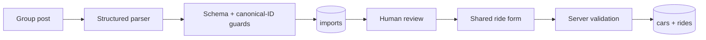

# How the AI works

Detail behind the AI summary in the [README](../README.md#how-the-ai-works).

## Import-to-ride boundary



Model output never publishes a ride directly. Imported and manually entered rides use the same
draft contract, and the stricter publishable schema is checked again on the server.

## Group-post parser (`lib/ai/parse-ride-post.ts`)

`parseRidePost` uses the OpenAI Responses API with a Zod-backed structured-output schema. It is
designed for informal posts containing Macedonian Cyrillic, Latin transliteration, mixed scripts,
landmarks, relative dates, offer/request wording, and several price modes.

The parser receives:

- An explicit current timestamp and the `Europe/Skopje` timezone
- Only the canonical city and pickup candidates loaded from Supabase
- Instructions to preserve uncertainty as warnings and leave unknown fields null
- The same partial ride-draft contract the review form consumes

After the model responds, ordinary code resolves the preserved raw origin/destination wording
through the canonical location resolver instead of trusting model-supplied IDs. Canonical names and
aliases match deterministically; only genuine misses may use the separate structured model fallback.
Pickup matches derive their city from the database vocabulary, fabricated IDs are rejected, and an
unresolved place clears model IDs and forces manual review. Additional guards clear invented
departure times and flag low-confidence output. The raw post and structured result are stored
together for the review step.

## Natural-language search (`lib/ai/parse-search-query.ts`, `lib/ai/explain-match.ts`)

Search dates and clock times are independent. Time-only searches apply to all upcoming rides;
date ranges apply the clock window on each selected day in `Europe/Skopje`, including DST changes.
The manual filters expose optional from/through dates and at-or-after/before times. A from date
alone means that single day; through dates are inclusive. Clock starts are inclusive and ends
exclusive; a start later than its end selects an overnight window on the selected calendar dates.
“Next few days” / “slednive nekolku dena” defaults to today plus the following two days, with a
review warning. “Nakaj 5” defaults to around 17:00 (16:00–18:00), with an afternoon-assumption warning.
The interpretation and editable controls show these choices. `dateFrom`/`dateTo` and
`timeAfter`/`timeBefore` are independent result fields; legacy `after`/`before` URL bounds remain
supported. The feed scans ordered pages until it finds 100 matches or exhausts the range, so
filtering out early rides does not hide later matches. This avoids a database migration, though
very broad time-only searches may need to read many pages.

`parseSearchQuery` separately turns a short search such as “Bitola Friday after 4” into nullable,
schema-validated origin, destination, time-bound, and seat fields. Canonical locations are resolved
against the same database vocabulary, unsupported criteria remain warnings, and only validated URL
filters reach the feed query. `explainMatch` receives a bounded batch of server-reloaded matching
ride facts and the parsed search context. Invalid, timed-out, missing-key, or unsupported responses
fall back to deterministic explanations; AI failure never removes the underlying ride results.

## Describing ride offers (`lib/ai/parse-offer-description.ts`)

On `/rides/new` a driver types one or several trips the way they would in a group chat ("Skopje →
Bitola Saturday 4pm, back Sunday evening, 3 seats"). The model returns one draft per trip; each
draft opens in its own tab and must be published separately. Seats and price are never guessed,
ambiguous times are flagged for review, and **Undo fill** restores the form. Full behaviour:
[ride-share-app/RIDE_OFFERS.md](../ride-share-app/RIDE_OFFERS.md).

## Chat summaries and questions (`lib/ai/chat-assistant.ts`, `lib/chat/ai-service.ts`)

In a private ride room, a member can press **Summarize chat** or **Ask AI** ("what did we agree
about pickup?"). The model gets the full room transcript the member is allowed to read and must
answer with source excerpts from real messages, so a newly accepted passenger can catch up on
what was agreed before they joined. Answers are private, marked out of date when new messages
arrive, rate-limited, and can be switched off with `CHAT_AI_ENABLED=false`. Privacy and limits:
[SAFETY.md](SAFETY.md#ai-chat-assistance).

## Road distance (not AI)

Once both cities are known, `/api/rides/distance` asks the public OSRM router for the city-to-city
driving distance. Our code makes this call, not the model. Failure leaves the km field editable.
Why city-to-city: [ADR 0001](adr/0001-city-to-city-road-distance.md).

## Fair price and CO2 (not AI)

The fair-price and CO2 calculator is intentionally **not AI**. It uses transparent arithmetic:

```text
distance_km × consumption_l_100km / 100 × fuel_price_mkd_l / seats
```

Tailpipe factors are 2.31 kg CO2/L for petrol and 2.68 kg CO2/L for diesel. Other fuel types are
reported as unsupported rather than receiving an invented conversion factor, and the driver may
always override the suggested price.


## Screenshot reader and tool-using checker

Enabled with `AI_IMPORT_PIPELINE_ENABLED=true` (server-side). It's on in the live deployment and in
`.env.example`. Only exactly `true` enables it; with it off, the screenshot endpoint returns 404
and text import skips the checker.

1. **Reader** ([`read-screenshot.ts`](../ride-share-app/lib/ai/read-screenshot.ts),
   [`/api/parse/screenshot`](../ride-share-app/app/api/parse/screenshot/route.ts)): one
   PNG/JPEG/WebP up to 4 MB, type and size checked before any model call. The model transcribes up
   to ten posts in their original script, labels each as offer, request or other, and marks
   unreadable fragments `[?]`. An unreadable image returns "Couldn't read this screenshot, paste the
   text instead". Images are never stored; they're sent with `store: false`.
2. **Driver picks one post**, which goes to the existing parser and code guards above.
3. **Checker** ([`check-ride-draft.ts`](../ride-share-app/lib/ai/check-ride-draft.ts)): the model
   chooses among three tools, within 4 rounds and 6 tool calls:
   - `road_distance`: the same OSRM city-to-city operation as the form, using canonical city IDs.
     The model can't supply coordinates.
   - `fair_price`: our deterministic fuel-cost formula ([`fair-price-tool.ts`](../ride-share-app/lib/ai/fair-price-tool.ts)).
     Code, not the model, flags a price only when it's more than 2.5× or less than 0.3× the estimate.
   - `find_similar_rides`: published rides on the same route within ±3 hours
     ([`similar-rides-tool.ts`](../ride-share-app/lib/ai/similar-rides-tool.ts)), shown as
     "possible duplicates".
4. **Evidence guard:** a finding is kept only if it cites a successful tool call. Code writes the
   warning wording and never changes the driver's fields. If the model or a tool fails, the draft
   still continues to review.

Verification records: [capabilities](verification/ai-import-capabilities.md),
[pipeline](verification/ai-import-pipeline.md), [reader](verification/ai-import-screenshot-reader.md),
[prices](verification/ai-import-prices.md), [duplicates](verification/ai-import-similar.md),
[live run](verification/ai-import-live.md), [review](verification/ai-import-review.md).
